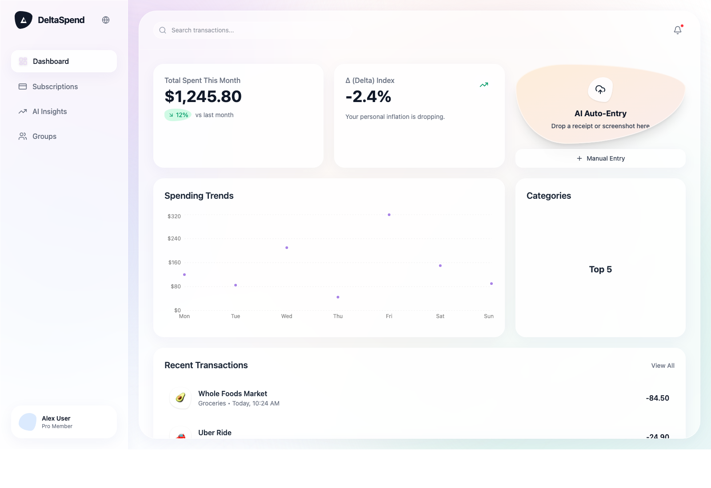
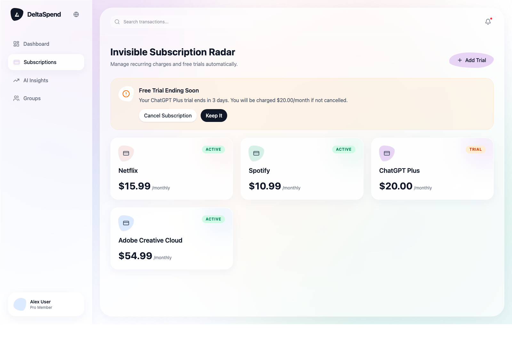
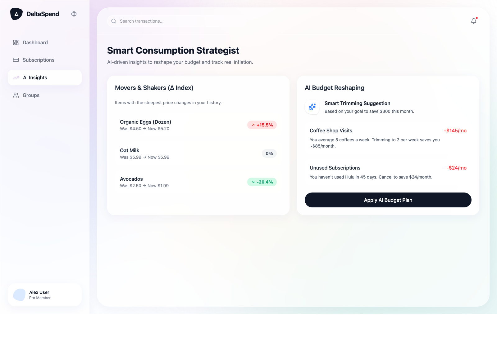
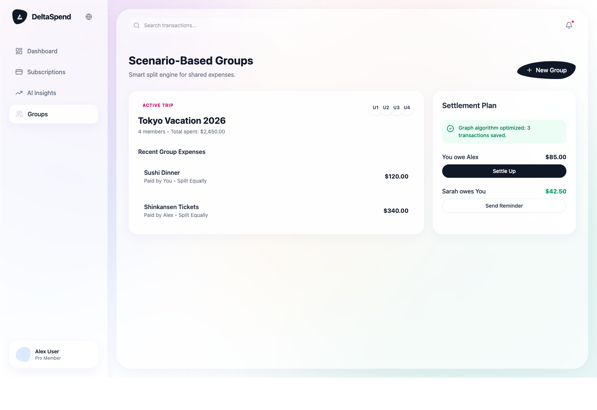

# DeltaSpend

DeltaSpend is a personal finance product concept that explores spending visibility, subscription awareness, AI-guided budgeting, and shared expense flows through an interactive frontend prototype.

## How To Review This Prototype

This repository is best reviewed in two parts:

- `Local interactive review`: run the prototype locally to click through the interface
- `Static visual review`: use screenshots in the README or related materials for quick visual reference

The main experience is the local interactive prototype. Screenshots are intended to support that review, not replace it.

## Run Locally

Prerequisite: `Node.js`

1. Install dependencies with `npm install`
2. Start the prototype with `npm run dev`
3. Open `http://localhost:3000/` in your browser

This prototype is a standalone frontend build and does not require Google AI Studio or any API key to run.

## Preview Images

These previews are static references. The recommended review path is still to run the prototype locally and click through the flows.

## What To Look At

The current prototype covers:

- `Dashboard`: spending overview, charts, and recent transaction patterns
- `Subscriptions`: recurring charge and free-trial management concepts
- `AI Insights`: inflation, budget reshaping, and spending recommendations
- `Groups`: collaborative expense tracking and settlement flows

## Design Materials

Supporting product and UX documentation:

- [docs/PRD.md](/Users/yangruofei/DeltaSpend/docs/PRD.md)
- [docs/UX_Design.md](/Users/yangruofei/DeltaSpend/docs/UX_Design.md)

## Notes

- The current implementation uses mocked data and interaction flows for product review
- A production website may be added later, but this repository currently serves as the prototype review environment
